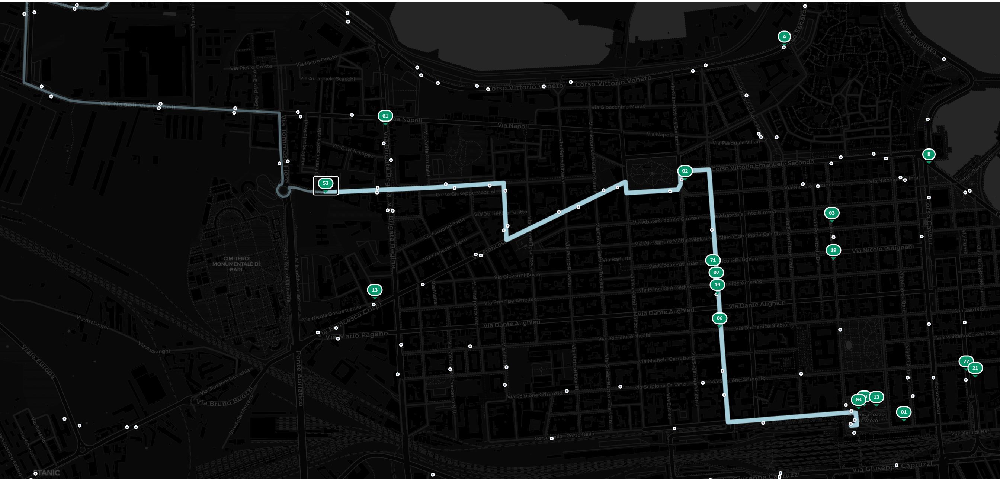
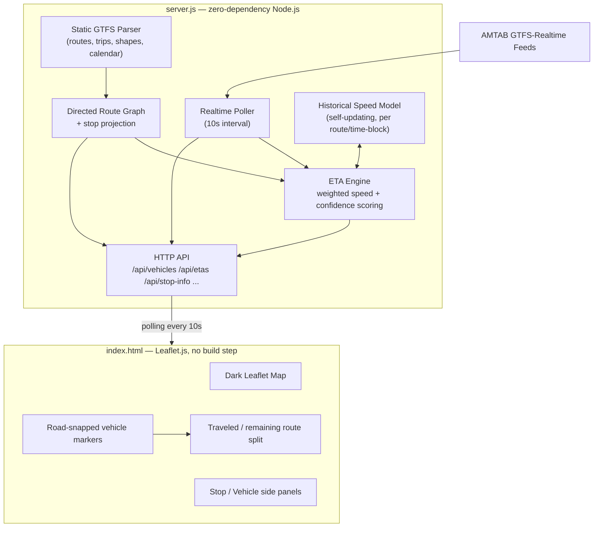

<div align="center">

# Bari AMTAB — Real-time Bus Map

**A live, geometrically-aware map of Bari's city buses — built from scratch, zero runtime dependencies.**

[](https://github.com/pancake37/bari-bus-map/actions/workflows/eslint.yml)




</div>

---

## What is this?

Most transit apps snap a bus to the nearest road and call it a day. This one goes further: it builds a **directed graph of every route shape**, projects each GPS ping onto it, and predicts arrival times per-segment using a blend of live speed and self-learned historical averages — all in a single dependency-free Node.js file.

No React. No build step. No database. Just `node server.js` and a browser tab.

## Features

| | |
|---|---|
| **Geometric ETA engine** | Projects each vehicle onto a directed graph of the route shape (not a straight line to the next stop) and predicts downstream arrivals segment-by-segment, blending instantaneous GPS speed with a self-learned historical average per route and time-of-day block. |
| **Confidence-scored predictions** | Cross-checks the geometric projection against the GTFS-RT `CurrentStopSequence` field. If they disagree by more than one stop, the ETA is flagged `low` confidence in the API and shown as an estimate in the UI instead of a live pulse. |
| **Calendar-aware schedules** | Parses `calendar.txt` / `calendar_dates.txt` so the stop timeline only shows trips that actually run *today* — no more Sunday-only routes appearing on a Tuesday. |
| **Road-snapped animation** | Buses animate along the actual route geometry between GPS updates (via waypoint interpolation), instead of cutting straight through city blocks. |
| **Self-learning speed model** | Historical average speed per route/time-block updates online from every observed GPS ping — no offline training step, no static lookup table. |
| **Graceful degradation** | If the AMTAB real-time feed hiccups, the server serves a 5-minute-TTL backup instead of an empty map. |
| **Minimalist dark map** | CartoDB Dark Matter tiles, POIs stripped, so roads/stops/vehicles are the only thing competing for attention. |
| **Lazy-loaded shapes** | The ~13 MB of route geometry is fetched per-route only on click, keeping cold start under 50 ms. |
| **One-tap deep links** | Stop and vehicle panels link straight out to Google Maps / Moovit by coordinates. |

## Architecture



## How the ETA model works

For the current segment (bus → next stop), speed is a weighted blend of live GPS speed and the historical average for that route/hour, weighted by how far along the segment the bus already is:

$$
v_i = \frac{S_{ib} \cdot v_r + S_{if} \cdot v_{ai}}{S_{ib} + S_{if}}
$$

Where $S_{ib}$ is distance already covered on the segment, $S_{if}$ is distance remaining, $v_r$ is the bus's current reported speed, and $v_{ai}$ is the learned historical average for that route and time-of-day block. Rush-hour (07:00–10:00, 15:00–19:00) applies a 0.85× dampening factor; downstream stops beyond the immediate segment fall back to the historical average alone.

The historical average itself is never hand-tuned — every valid GPS observation (`speed > 10 km/h`) folds into the running average for its route and 2-hour time block, so the model adapts as AMTAB's actual traffic patterns change across seasons.

## API Reference

| Endpoint | Returns |
|---|---|
| `GET /api/vehicles` | Live vehicle positions from the GTFS-RT feed |
| `GET /api/trip-updates` | Per-trip delay data |
| `GET /api/etas` | `{ [stopId]: { [routeId]: { eta, delay, vid, confidence } } }` |
| `GET /api/routes` | Static route metadata |
| `GET /api/stops` | All stop coordinates |
| `GET /api/shapes?id=X&encoded=1` | Encoded polyline for a route shape |
| `GET /api/stop-info` | Today's active departures per stop (calendar-filtered) |
| `GET /api/route-shapes` | Shape IDs grouped by route |
| `GET /api/stats` | Live vehicle count, ETA coverage, buffer sizes |

## Quick Start

```bash
git clone https://github.com/pancake37/bari-bus-map.git
cd bari-bus-map
# place AMTAB's static GTFS archive as google_transit.zip in the repo root
node server.js
# open http://localhost:3000
```

No `npm install` required for the server — it runs on Node's built-in `http`/`fs`/`child_process` modules only.

## ⚠️ Known Limitations

- **Windows-only static GTFS extraction** — the zip archive is currently unpacked via a `PowerShell -Command Expand-Archive` call. On Linux/macOS, `extractAll()` fails silently and the server falls back to whatever is already cached. A cross-platform (zero-dependency) unzip is planned.
- **In-memory state only** — vehicle/ETA caches live in process memory; running multiple server instances behind a load balancer will give each instance a different view of historical speeds.
- **No authentication or rate limiting** on the API — fine for local/single-user use, not yet hardened for public multi-tenant deployment.

## Roadmap

- [ ] Cross-platform static GTFS extraction (drop the PowerShell dependency)
- [ ] On-time-performance (OTP) metric computed from logged observations
- [ ] Periodic re-fetch of `google_transit.zip` beyond the current 24h in-process refresh

## License

No license file is currently published in this repository — all rights reserved by default until one is added. If you intend for others to reuse this code, consider adding an [MIT](https://choosealicense.com/licenses/mit/) or similar permissive license.

## 🙏 Data Source

Built on official [AMTAB](https://www.amtab.it/) (Azienda Mobilità e Trasporti Bari) GTFS and GTFS-Realtime feeds. Not affiliated with or endorsed by AMTAB.
